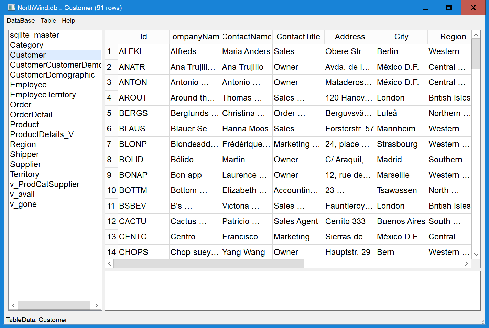
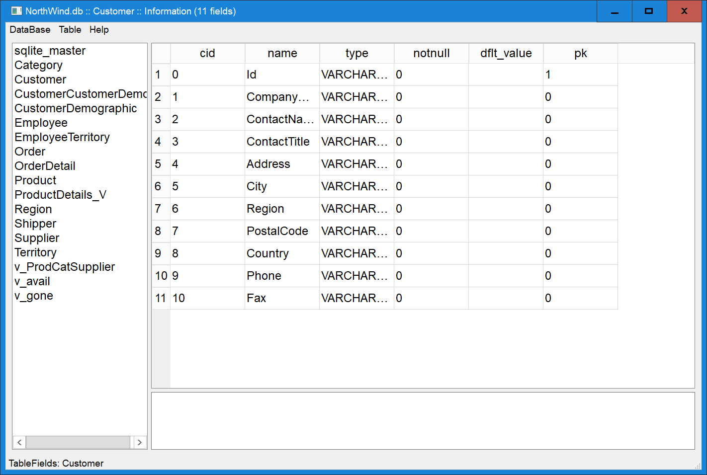
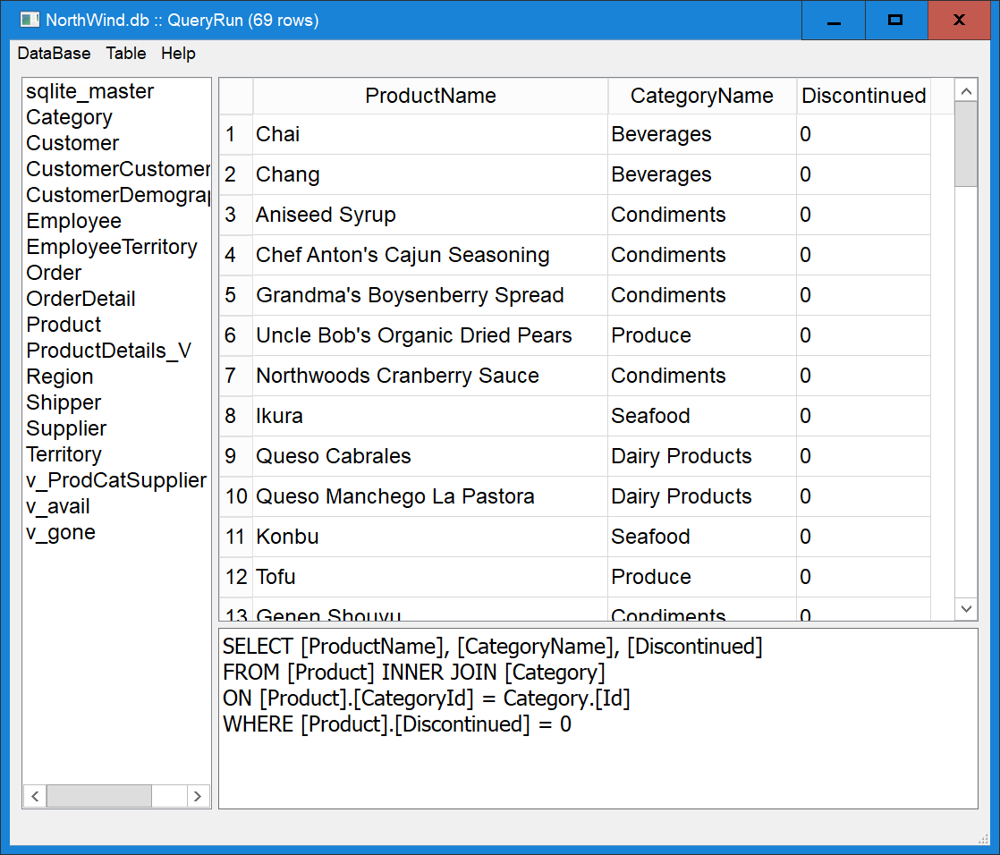

Python PyQt QtSQL Browser
https://github.com/vx1920/qsb
=============

QSB (Qt Sql Browser) allows view/edit SQLite tables and definitions and run queries.
It may be useful to learn Python, Qt and SQLite (especially during bug fixing).
By default, it will open database NorthWind.db, default table "sqlite_master".
It can be overridden by command line arguments: "qsb.py DataBase.db [sqlite_master]". 

Main window has two sliders to make three panels:
 - Table List on the left.
 - Table Panel as right-upper panel.
 - Text Panel as right-lower panel.

Show editable table data and table definitions (read-only, left or right click in Table List):

Right click on data field for context menu to copy field data to/from Text Panel.

SQLite views are supported and shown in Table List along with tables.
Left click will show read-only query result and right click will show 
SQL definition for the view from master table.

Execute Query 
---------------
Edit query in text panel under table, run from Database menu.
Resulting read-only table will be shown:

In case of errors in query: TableView will be switched to TextView and error info will be shown.

Add/Remove rows: use commands from Table menu.

See more details in the source code.
Python version can be 3.6 and higher.

